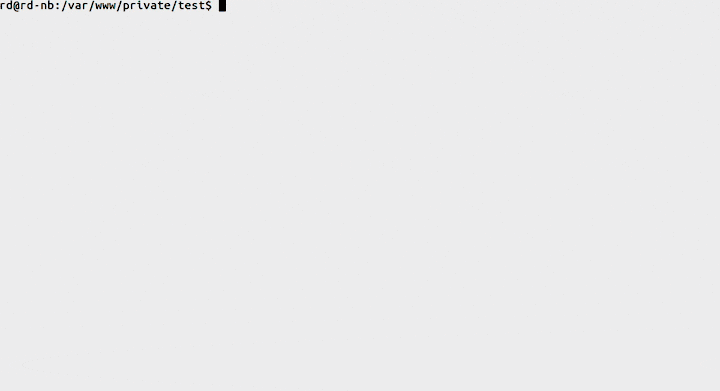

tleaf
===

> AngularJS unit test generator

Command line [npm](https://www.npmjs.com/) utility tool built on [Node.js](https://nodejs.org/) to generate [AngularJS](https://angularjs.org/) unit tests based on existing code or create them from scratch.



#### Contents:

  * [How does it work?](#how-does-it-work)
  * [Installation](#installation)
  * [Usage](#usage)
  * [Configuration](#configuration)
  * [Custom templates](#custom-templates)
    * [Data available in templates](#data-available-in-templates)
    * [Examples](#examples)
    * [Extra helpers](#extra-helpers)

## How does it work?

It takes your AngularJS source file and parses it with the help of [esprima](http://esprima.org/) - standard-compliant ECMAScript parser, which results into a code syntax tree. The tree is being analyzed for AngularJS units and based on that information it generates a test file from pre-defined templates, setting up the collected data for unit tests.

*Note: source code can be very different and complex from project to project (and from person to person), so it's really difficult to cover all cases and styles of writing AngularJS applications to be able to extract required information. If your AngularJS source code is not getting parsed as expected, feel free to create an issue with an example of the source code causing the problem or PR a test reproducing it.*

## Installation

Install module globally:

```bash
$ npm i tleaf -g
```

## Usage

***

```bash
$ tleaf SOURCE DEST
```

* `SOURCE` - path to AngularJS source code with a unit to test
* `DEST` - path to output test file

The command parses your source file and extracts all AngularJS units. After that you will be asked which one you'd want to test and also to identify the dependencies. The result will be a test file generated based on a template for this unit type.

***

```bash
$ tleaf create DEST
```

* `DEST` - path to output test file

The command creates a test file based on answers you provide for a number of questions: *What is a name of the unit?* *What is a type of the unit?* *What are unit's dependencies?* The result will be a test file generated based on a template for this unit type.

***

```bash
$ tleaf init [DIRECTORY]
```

* `[DIRECTORY]` - *(optional)* path to output folder

The command copies a configuration file to a directory you've provided. If directory is not specified, the configuration file will be copied to a current directory.

***

```bash
$ tleaf clone [DIRECTORY]
```

* `[DIRECTORY]` - *(optional)* path to output folder

The command copies default templates to a directory you've provided. If directory is not specified, the folder will be created in a current directory. As a result you'll be able to modify copied templates for your needs and requirements and use them instead of default templates to generate test files (see more in [Custom templates](#custom-templates)). This folder can be initialized anywhere on your machine, you can use the same configuration and set of templates for multiple projects (see commands below to switch between configurations). It can be included under version control system, but it is not required at all, it's up to you.

***

```bash
$ tleaf use CONFIG
```

* `CONFIG` - path to configuration file

The command sets current configuration which will be used to generate test files. It accepts a path to a configuration file created by executing a command `tleaf init [DIRECTORY]` or a configuration file inside a folder, which was created by executing a command `tleaf clone [DIRECTORY]`. It assumes that custom templates are in the same folder with the configuration file, following the same structure when you cloned them with `tleaf clone [DIRECTORY]`. The command allows you to switch between different configurations and set of templates.

***

```bash
$ tleaf default
```

  The command allows to switch back to the default configuration and set of templates.

***

```bash
$ tleaf current
```

  The command shows what configuration is used at the moment.

***

## Configuration

[Default configuration file](src/defaults/tleaf.conf.js) contains only a few commonly used options ([see the complete configuration](src/config/default.js)). Your configuration will be merged with the default complete configuration, arrays will be overriden by your values (not merged). Available options:

* `template.indent: [string|integer]` - sets indentation for templates. Tabs by default (`'\t'`). A string will replace one tab. An integer will be a number of spaces to replace one tab.

  ```js
  module.exports = function (config) {
    config.set({
      template: {
        indent: '  '    // 1 tab = 2 spaces,
        indent: '\t'    // 1 tab = 1 tab
        indent: 4       // 1 tab = 4 spaces
        indent: '--'    // 1 tab = '--'
      }
    });
  };
  ```
* `template.useStrict: [bool]` - include `'use strict';` to the top of a generated test file.

  ```js
  module.exports = function (config) {
    config.set({
      template: {
        useStrict: true     // include
        useStrict: false    // don't include
      }
    });
  };
  ```

* `template.includeSamples: [bool]` - add commented examples of basic specs to a generated test file.

  ```js
  module.exports = function (config) {
    config.set({
      template: {
        includeSamples: true  // include
        includeSamples: false // don't include
      }
    });
  };
  ```

* `units.process: [array]` - array of unit types which should be parsed and processed. To reorder the appearance of unit types change their order in this array. See the [complete configuration](src/config/default.js#L22) for all possible options.

  ```js
  module.exports = function (config) {
    config.set({
      units: {
        // process only controllers, directives and providers
        // these types will appear in the exact same order
        process: ['controller', 'directive', 'provider']
      }
    });
  };
  ```

* `dependencies.process: [array]` - array of dependency types which should be parsed and processed. To reorder the appearance of dependency types change their order in this array. See the [complete configuration](src/config/default.js#L34) for all possible options.

  ```js
  module.exports = function (config) {
    config.set({
      dependencies: {
        // process only services and values, others will be ignored
        // these types will appear in the exact same order, which means that
        // all services will be rendered first, then all the values, etc.
        process: ['service', 'value']
      }
    });
  };
  ```

* `dependencies.filter: [array]` - array of dependency names, which should be ignored, by default only `$scope` is excluded. If you override this value make sure to include `$scope` too (if you need it to be exluded).

  ```js
  module.exports = function (config) {
    config.set({
      dependencies: {
        // ignore dependencies with these names
        filter: ['$scope', 'GlobalService', 'SECRET_CONST']
      }
    });
  };
  ```

* `dependencies.templateMap: [object]` - object, which maps dependency types with templates they should use. May be useful, for example, when you want to render *factories* or *services* using *value* template. See the [complete configuration](src/config/default.js#L42) for all possible options.

  ```js
  module.exports = function (config) {
    config.set({
      dependencies: {
        templateMap: {
          'provider': 'provider', // use default provider template
          'service': 'value',     // use value template for service
          'factory': 'service'    // use service template for factory
        }
      }
    });
  };
  ```

## Custom templates

Test files are generated from the templates, which are kinda JavaScript files, but they get processed like templates to be able to fill it with the gathered data.
When you run the command `tleaf clone [DIRECTORY]`, all default templates and a configuration file are copied to the location you've provided.
Most of the templates are based on [yeoman/angular-generator](https://github.com/yeoman/generator-angular) and [daniellmb/angular-test-patterns](https://github.com/daniellmb/angular-test-patterns), the rest of the templates are made by taking already existing ones as an example. You can take a look at the [default templates](src/defaults/templates), they have pretty simple base setup, which might be enough for general use.
Templates are processed by the templating engine [Handlebars](http://handlebarsjs.com/), so you can use any of it's features.

### Data available in templates

Information, which is being collected by a parser or from your answers, gets passed to the templates. Here is a structure of the data available in the templates, consider it a global object in your templates (taking some controller as an example):

```js

{
  // top level

  unit: {

    name: 'UserController',

    type: 'controller',

    module: {
      name: 'admin'
    },

    deps: [
      {
        name: '$http',
        type: 'provider'
      },
      {
        name: 'UserService',
        type: 'service'
      },
      {
        name: 'API_KEY',
        type: 'constant'
      }
    ]
  },

  // top level

  // shortcut for: unit.name
  name: 'UserController',

  // shortcut for: "_" + unit.name + "_"; useful in provide() section
  _name_: '_UserController_',

  // shortcut for: unit.module.name
  module: 'admin',

  // shortcut for: unit.deps; plus some additions
  deps: [
    {
      name: '$http',
      _name_: '_$http_',
      type: 'provider'
    },
    {
      name: 'UserService',
      _name_: '_UserService_',
      type: 'service'
    },
    {
      name: 'API_KEY',
      _name_: '_API_KEY_',
      type: 'constant'
    }
  ],

  // top level

  // args are usually used to render variables or arguments
  arg: {

    // shortcut for unit names
    deps: ['$http', 'UserService', 'API_KEY'],

    // shortcut for unit names; useful in provide() section
    _deps_: ['_$http_', '_UserService_', '_API_KEY_']

  },

  // top level

  // references to config values
  opts: {

    useStrict: true,

    includeTemplates: true

  }

}
```

### Examples

Here you can find some examples of composing the templates. You can discover more use-cases by looking at the [default templates](src/defaults/templates).

1. Load module:

  Template:

  ```js
  module('{{module}}');
  module('{{unit.module.name}}')
  ```

  After render:

  ```js
  module('admin');
  module('admin');
  ```

2. Initialize variables:

  Template:

  ```js
  var {{name}}{{and arg.deps}};
  var {{only arg.deps}};
  ```

  After render:

  ```js
  var UserController, $http, UserService, API_KEY;
  var $http, UserService, API_KEY;
  ```

3. Provide dependencies:

  Template:

  ```js
  module(function ($provide) {
    {{#each deps}}
    {{> (this.partial) this}} // renders a partial for a current dependency
    {{/each}}
  });
  ```

  After render:

  ```js
  module(function ($provide) {
    $provide.provider('$http', function () {
      this.$get = function () {
        return {};
      };
    });
    $provide.service('UserService', function () {
    });
    $provide.constant('API_KEY', '');
  });
  ```

### Extra helpers

Handlerbars allows to create custom helpers to help render the data. Here are the ones built-in in the module:

* `{{only array}}` - joins array of strings with `", "`:

  ```js
  $http, UserService, API_KEY
  ```

* `{{and array}}` - joins array of strings with `", "`, but also adds extra `", "` in front:

  ```js
  , $http, UserService, API_KEY
  ```

* `{{dashCase string}}` - converts string to dash-case, useful when working with directives:

  ```
  "ngBindHtml" => "ng-bind-html"
  ```

* `{{defaults value defaultValue}}` - renders *value* if it is not *undefined*, *defaultValue* otherwise.

## Changelog

- 0.2.0 - Support for Angular 1.5 components
- 0.1.0 - Initial